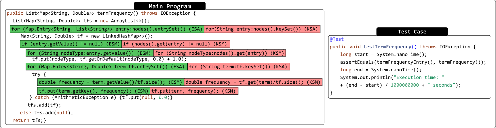

<h3 align = "center"> cTREE: Code Performance Prediction by Feeding Stylometry Trees to Regression Models </h3>
<hr>

## Abstract
> Software development teams establish elaborate Continuous Integration (CI) pipelines containing automated test cases to accelerate the development process of software. Automated tests help to verify the correctness of code modifications and decrease the response time to changing requirements. However, when the software teams do not track the performance impact of pending modifications, they may need to spend considerable time refactoring existing code. This paper proposes cTREE, a  CI pipeline-assisted code analysis framework that provides continuous feedback on the performance impact of pending updates. We design performance microbenchmarks by binding the execution time of embedded automated test cases given a code update to the corresponding code abstract syntax tree. Next, we extract numerical statistic code-stylometry and distributional semantic code-stylometry embedding features from the source code feed to regression models tasked with predicting the execution time of pending updates on the go to provide continuous feedback. Our experiments achieved state-of-the-art performance in predicting the execution time performance of code updates to the software. 

<hr>
Artifact Author: Chidera Biringa
<hr>

## Problem
<p align="center">  </p>

<!-- ## Proposed Solution: c-TREE -->

<!-- 
## How to generate DSPACE dataset
```
$ cd dataset/dspace
$ sh build.sh 
```

## Feature Engineering
### Generate Stylometry AST Embedding Features
```
cd embeddings
sh build.sh
``` -->
