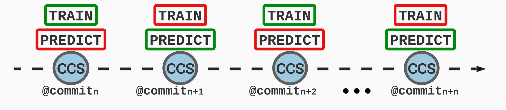
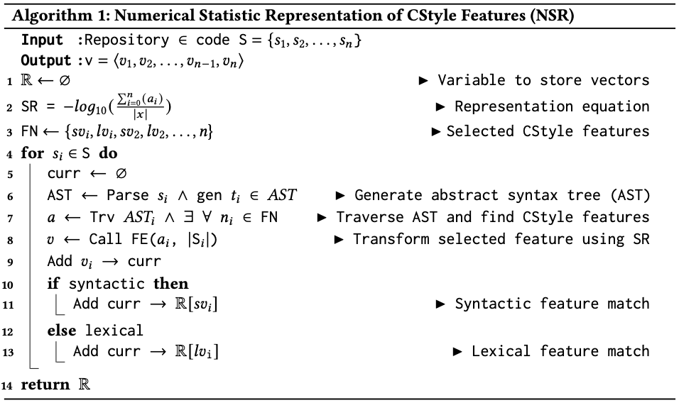

<h3 align = "center"> PACE: Program Analysis Framework for Continuous Performance Prediction </h3>
<hr>

<p align="center">  </p>

Official implementation of ```PACE: Program Analysis Framework for Continuous Performance Prediction``` to undergo review. For reviewer(s), please follow the instructions below to reproduce the results presented in the paper. 

## Abstract
> Software development teams establish elaborate continuous integration pipelines containing automated test cases to accelerate the development process of software. Automated tests help to verify the correctness of code modifications decreasing the response time to changing requirements. However, when the software teams do not track the performance impact of pending modifications, they may need to spend considerable time refactoring existing code. 
> 
> This paper presents PACE, a code analysis framework that provides continuous feedback on the performance impact of pending code updates. We design performance microbenchmarks by binding the execution test times of embedded automated test cases given a code update and map the execution test times to numerical statistics and distributional semantic code stylometry features used as input observations to predictive models tasked with code performance predictions. Our experiments achieved state-of-the-art performance in predicting the execution time performance of code updates to the software.

<hr>

> Note: Full paper details will be chronicled post-acceptance. PACE's [feature engineering](#feature-engineering) methods are the most transferable component of this work and are applicable in several other use cases beyond performance research. We leverage knowledge in code (SWE) and language (NLP) understanding to statistically and distributionally extract input features. 

<hr>
Artifact Author: Chidera Biringa
<hr>

## Installation
```
$ git clone https://github.com/biringaChi/PACE 
$ pip install -r requirements.txt 
$ cd src
```

## Problem Definition
<p align="center">  </p>

> Figure 1: Access and manipulation of a Linked-HashMap (LHM) using an Entry-set and Key-set. ESA and ESM denote Entry-set Access and Manipulation. KSA and KSM represent Key-set Access and Manipulation. Lines of code highlighted in green and red are LHM access and manipulation using  Entry-set and Key-set.

In this work, a code snippet or program is mediocre if it introduces a significant performance overhead to software and consequently skews the baseline resulting in an outlier performance. For example, consider the motivating example above. The snippet is a real-world fragment of a Java program, and it calculates the term frequency of more than 2000 elements in a linked hashmap (LHM). An LHM combines a hash table and a linked list. It ensures the predictable maintenance of elements in an iterable object. The peripheral difference between the snippets is in how the linked hashmap is accessed (ESA), (KSA), and manipulated (ESM), (KSM) using an ```entrySet()``` and ```keySet()``` respectively. On a test level, the ESA and ESM, and KSA and KSM versions of the code snippet execute in ```4 seconds``` and ```4 minutes``` as tested in our test environment, which means there is a ```6000% increase``` in ET. The difference decreases by half to ```3000%```, with an increase in the number of elements from 2,000 to 200,000. 

> Note: we are working under the assumption of an ```ideal``` software development environment, where external variables such as memory usage and network connectivity relatively outside the developer's control are operating at ```optimal``` levels.

## Microbenchmarking
Software performance microbenchmarking is a standardized procedure to experimentally analyze the execution time of non-functional components of the software, such as code snippets.  Test case results serve as the microbenchmarks, ground truth target variables fed to implemented predictive models for performance predictions.

## Continuous Predicitons & Deduplication
We propose continuous or rolling predictions in line with our goal of predicting the performance of the local software repository before being pushed to its remote counterpart. Encapsulated in the Figure displays base repository copy ```n``` is the repository's current code state (CCS), while ```n-1``` is a local version consisting of an updated CCS in the queue to be pushed to remote. We feed  ```n``` (training set) to a regression function ($\phi$) to predict the performance of ```n-1``` (testing set). We repeat this process for ```n-n``` times. Furthermore, it eliminates duplicated observations. 


<p align="center">  </p>

## Code Stylometry Feature Engineering
Code-stylometry (CStyle) is the stylometric analysis of a code's syntactic and lexical characteristics. In principle, cstyle is akin to stylometry. Contrastly, in stylometry, we analyze natural languages, while cstyle involves the analyses of programming languages. 

### (Taxonomy of Code Stylometry Features (CSF))
<hr>
### Feature Selection

 ```{Statements, Controls, Expressions}``` $\in$ ```Syntactic``` $\land$ ```{Invocations, Declarations}``` $\in$ ```Lexical``` 
| Class | Types | Brief Description | 
| --------------- | --------------- | --------------- |
| Statements | IfStatement, WhileStatement, DoStatement, AssertStatement, SwitchStatement, ForStatement, ContinueStatement, ReturnStatement, ThrowStatement, SynchronizedStatement, TryStatement, BreakStatement, BlockStatement, BinaryOperation, CatchClause | Dictates the behavior of a program under explicitly defined conditions |
| Controls | ForControl, EnhancedForControl 	  | Defines the repetition of instructions dependent on the satisfaction of requirements |
| Expressions | StatementExpression, TernaryExpression, LambdaExpression	  | Independent language entities with unique definitions |
| Invocations | SuperConstructorInvocation, MethodInvocation,  SuperMethodInvocation, SuperMemberReference, ExplicitConstructorInvocation, ArraySelector, AnnotationMethod, MethodReference | Defines the invocation of a program from another program |
| Declarations | TypeDeclaration, FieldDeclaration, MethodDeclaration, ConstructorDeclaration, PackageDeclaration, ClassDeclaration, EnumDeclaration, InterfaceDeclaration, AnnotationDeclaration, ConstantDeclaration, VariableDeclaration, LocalVariableDeclaration, EnumConstantDeclaration, VariableDeclarator  | Declares the existence of an entity in memory and assigns a value to that entity |

### Feature Representation
The natural consequence of selecting features for predicting modeling is its representation. Thus, we design frequency and neural based-algorithms to numerically transform selected features.  <br />
 ```Pros of representation algorithms include:```
- Significant reduction in conventional vocabulary size due to application of domain (code stylometry) knowledge understanding. <br />
- Increased predictor training and prediction speed. <br />
- Significant reduction in sparse vectors.
<!-- #### AG1: Numerical Statistic Representation of CSF (NSR) -->

<!-- ### ```AG's 1 & 2```
<hr>
<p align="center">
     &nbsp;
   
</p> -->

## Reproducing Results in Paper
RQ1: Predictive Prowess
```
$ TODO
```

RQ2: Throughput and Latency Analysis of CSF Selection & Statistic and Neural Representations
```
$ TODO
```

RQ3: Comparison With the State-of-the-Art Approach
```
$ TODO
```
 