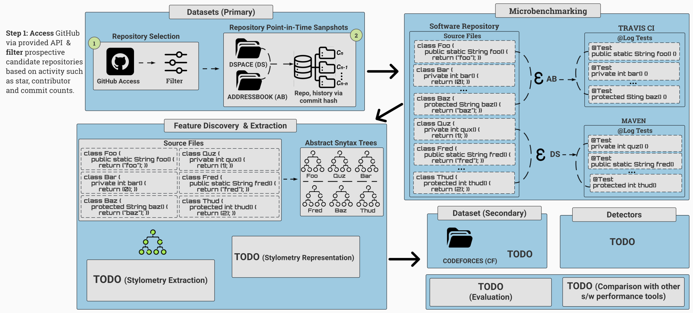

<h3 align = "center"> SARA: Code Performance Prediction by Mapping Execution Test Times to Stylometry Features</h3>
<hr>

<p align="center">  </p>

Official implementation of SARA to undergo review. For reviewer(s), please follow the instructions below to reproduce the results presented in the paper. 

## Abstract
> Software development teams establish elaborate continuous integration pipelines containing automated test cases to accelerate the development process of software. Automated tests help to verify the correctness of code modifications decreasing the response time to changing requirements. However, when the software teams do not track the performance impact of pending modifications, they may need to spend considerable time refactoring existing code. 
> 
> This paper presents SARA, a code analysis framework that provides continuous feedback on the performance impact of pending code updates. We design performance microbenchmarks by binding the execution time of embedded automated test cases given a code update and map aforementioned execution times to numerical statistics and distributional semantic code stylometry features used as input features to predictive models for performance predictions. Our experiments achieved state-of-the-art performance in predicting the execution time performance of code updates to the software.

<hr>
Artifact Author: Chidera Biringa
<hr>

## Motivation
<p align="center">  </p>

> Figure 1: Access and manipulation of a Linked-HashMap (LHM) using an Entry-set and Key-set. ESA and ESM denote Entry-set Access and Manipulation. KSA and KSM represent Key-set Access and Manipulation. Lines of code highlighted in green and red are LHM access and manipulation using  Entry-set and Key-set.

In this work, a code snippet or program is mediocre if it introduces a significant performance overhead to software and consequently skews the baseline resulting in an outlier performance. For example, consider the motivating example above. The snippet is a real-world fragment of a Java program, and it calculates the term frequency of more than 2000 elements in a linked hashmap (LHM). An LHM combines a hash table and a linked list. It ensures the predictable maintenance of elements in an iterable object. The peripheral difference between the snippets is in how the linked hashmap is accessed (ESA), (KSA), and manipulated (ESM), (KSM) using an ```entrySet()``` and ```keySet()``` respectively. On a test level, the ESA and ESM, and KSA and KSM versions of the code snippet execute in ```4 seconds``` and ```4 minutes``` as tested in our test environment, which means there is a ```6000% increase``` in ET. The difference decreases by half to ```3000%```, with an increase in the number of elements from 2,000 to 200,000. This above-stated performance discrepancy might appear inconsequential for isolated occurrences. However, in scenarios where that low-performing program is deployed and used in multiple areas of a software product or feature, it would significantly increase the overall time of an operation to complete.  

> Note: we are working under the assumption of an ```ideal``` software development environment, where external variables such as memory usage and network connectivity relatively outside the developer's control are operating at ```optimal``` levels.
>
